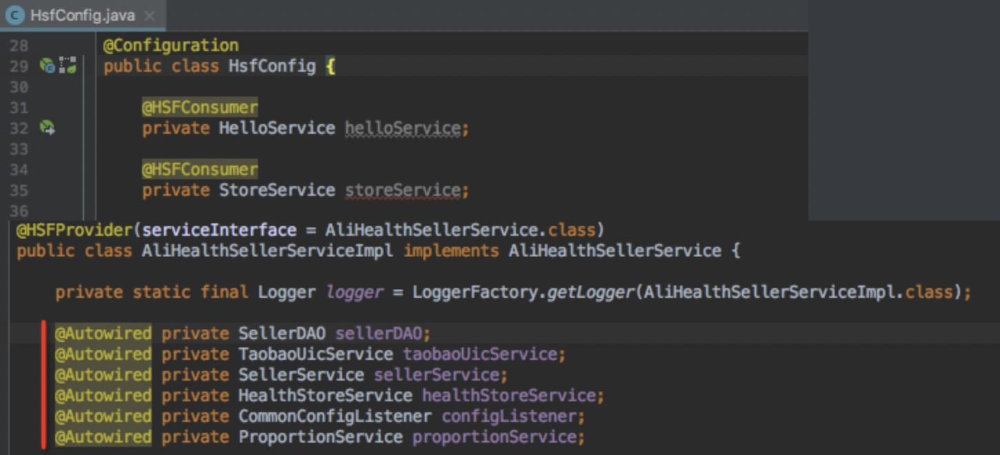

## 1 什么是HSF

全称：High-Speed Service Framework

主要参考：https://www.atatech.org/articles/141851

HSF服务广义上是一个RPC框架，RPC（Remote Produce Call）指远程服务调用，在分布式场景下应运而生。

**作用：**HSF 作为阿里巴巴的基础中间件，联通不同的业务系统，解耦系统间的实现依赖。HSF 从分布式应用的层面，统一了服务的发布/调用方式，从而帮助用户可以方便、快速的开发分布式应用，以及提供或使用公共功能模块。为用户屏蔽了分布式领域中的各种复杂技术细节，如：远程通讯、序列化实现、性能损耗、同步/异步调用方式的实现等。

### 1.1 简单概括

简单的RPC框架如下图所示：

Consumer发起调用服务的请求，Provider接受请求后执行，并将执行结果返回给Consumer。


### 1.2 应用场景

主要是为了解决应用之间的耦合问题，联结不同的业务服务，统一所有应用服务的发布调用方式，从而可以帮助开发者更好的开发应用。

举例子：ata文档【初学HSF】https://www.atatech.org/articles/141851

### 1.3 总体框架


#### 1.3.1 几大模块介绍

#### 【地址注册中心ConfigServer】

可以把它看成一个具有聚合功能的内存数据库，用来管理整个分布式集群里所有的服务及其提供者IP的对应关系（存放某个服务所在机器的IP、端口号等信息）。

相当于一个**中间媒介、推送模型**，可以让应用自动的发布服务并且获取其他服务地址。

#### 【持久化配置中心Diamond】

用于存储HSF服务的各种治理规则，HSF客户端在启动的过程当中会向持久化配置中心订阅各种服务治理的规则，如路由规则、归组规则、权重规则等，从而可以根据这些规则实现对调用过程的选址逻辑进行干预。

持久化配置中心使用的是Diamond来实现的。它是一个基于Http长轮询的配置注册中心，使用mysql进行配置的持久化管理，并且使用多个缓存来保证高可用性。

#### 【元数据存储中心Redis】

元数据指的是HSF服务对应的方法列表以及参数结构等信息，元数据不会对HSF的调用过程产生影响，因此元数据存储中心也并不是必须的，仅仅为为了方便运维。

元数据存储中心是使用Redis实现的。

#### 【HSF控制台】

HSF控制台通过以上几个服务中心为用户提供了可视化的运维功能。

地址：http://hsf.alibaba.net/hsfops/serviceSearch.htm?spm=a1zco.hsf.0.0.7f212320Y0S2Ka&envType=daily

#### 1.3.2 流程

1️⃣Provider向ConfigServer注册地址，说明“我有什么服务”以及“我的ip”

2️⃣ConfigServer将该服务和对应的ip存到地址列表里

①Consumer向ConfigServer订阅地址，说明“我需要什么服务”

②Consumer获取对应的ip（可能有多个）

③Consumer直接向Provider（在2.②的多个ip中选择一个）进行远程调用，即点对点调用服务

PS：服务提供方在发布地址的同时也会上报到元数据存储中心，提供给服务运维使用。


## 2 spring boot怎么用HSF接口

- 怎么发布和调用？
  参考文档：[hsf接口发布调用&新手须知](https://www.atatech.org/articles/120569?spm=ata.13269325.0.0.35ab49fanWmibk)      [官方文档](http://gitlab.alibaba-inc.com/spring-boot/spring-boot-starter-hsf?spm=ata.13261165.0.0.40645b66ta59yA)

> 在ata上的会有一些简单hsf接口发布与调用的文档说明，其中在发布服务时要先配置服务，大多数用的是“spring xml”和“api配置服务”这两种。而在实际的项目中（spring boot项目）则是通过“注解配置服务”的居多。
>
> 
>
> 以下根据自己所在业务项目代码来说明下：
>
> SpringBoot中不建议使用XML配置，所以比较常用的是使用ConfigurationProperties注解创建bean从application.properties中加载配置项。

### 2.1 注解配置服务发布

#### 1、在spring boot中首先要增加依赖starter

在pom.xml文件中添加依赖，ptc-service目录下

(为什么找不到别人文章中的LightApi?:引入的组包不一样，但是都支持hsf泛化调用的方法)


```
<dependency>
    <groupId>com.aliexpress.boot</groupId>
    <artifactId>spring-boot-starter-hsf</artifactId>
    <version>1.1.0-SNAPSHOT</version>
</dependency>
```

#### 2、将@HSFProvider 配置到实现的类型上

在发布的服务的实现类上添加@HSFProvider注解，其中serviceInterface是要发布服务的接口

```
@HSFProvider(serviceInterface = SimpleService.class)
public class SimpleServiceImpl implements SimpleService
```

（@HSFProvider 的选项中，例如 serviceVersion 和 serviceGroup，如果没有指定，会使用 application.priorities 中的全局配置；如果自行指定，则会覆盖全局配置）


在aone上将此次变更发布到日常，然后在ops上查看是否有已经写好的hsf。在opsf可以测试下该服务正确性，也可以通过新建项目创建contrller的形式进行验证。


#### 3、application.priorities配置HSF

在application.priorities 设置下 HSF 的基本配置（spring.hsf.group|version|timeout）application.priorities的配置使用：[https://www.cnblogs.com/shamo89/p/8178109.html](https://www.cnblogs.com/shamo89/p/8178109.html?spm=ata.13261165.0.0.44595291Vs6StE)

在properties添加hsf的版本信息和客户端超时信息

```
spring.hsf.group=HSF
spring.hsf.version=1.0.0.daily
spring.hsf.timeout=3000
```

#### 4、测试已发布的hsf接口

本地项目 hsf接口发布默认发布到日常环境（调试）

https://www.atatech.org/articles/113884

### 2.2 注解配置服务调用

#### 1、增加依赖starter


#### 2、增加@HSFConsumer标记

通常一个HSFConsumer需要多个地方使用，担并不需要使用的地方都样@HSFConsumer来标记，只需要写一个统一的config类，然后其他地方需要的地方，直接用@Autowired注入即可



#### 3、@Autowired配置服务调用

@Autowired

1、引入服务依赖的组包

2、配置一个HSFSpringConsumerBean，新建一个xxx-bean.xml

3、在springboot中引入该xml文件（main文件）

4、@Autowired 注解服务调用

> 泛化调用：客户端不需要依赖服务端的二方包，也就是本地不需要持有对应的接口，即可调用。对于一些平台化的产品，减轻自身重量是非常有帮助的。
>
> 在ata上的一些文档上可能会通过工程简单介绍下如何泛化调用，泛化调用

